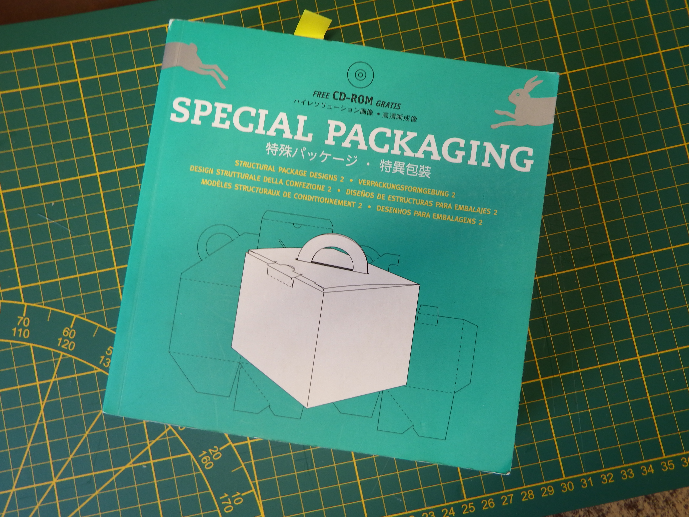
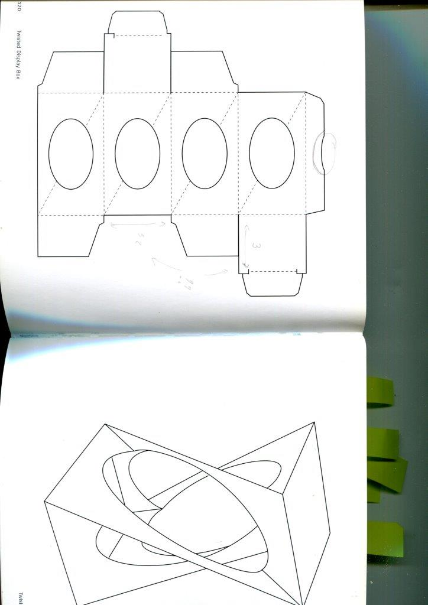

# Iris-boxes
 Program and cut boxes with iris locking lids // Programmer et couper des boîtes à ouverture en iris

*** English version below (maybe)***

# Présentation

Le but de ce 'projet' est de généraliser le design de la page 120 du livre **Special Packaging**, acheté il y a vingt ans dans un musée de Bruxelles (voir photos). 

Les généralisations sont de plusieurs ordres : 
1. Obtenir un fichier SVG directement utilisable dans Inkscape et pour la découpe laser. 
2. Pouvoir construire des boîtes avec un nombre quelconque de côtés. 
3. Contrôler par programme la taille de l'objet (hauteur, largeur, forme des ellipses). 
4. Fabriquer des couvercles et des fonds de boîte *homogènes*, c'est-à-dire avoir des languettes toutes identiques.
5. Effet de bord, j'ai aussi été obligé de définir une fonction permettant de définir des lignes de découpe de pointillés, car la découpeuse laser ne reconnaît pas les 
pointillés d'Inkscape. J'ai entendu dire que c'était pareil pour Illustrator. 

Le programme est écrit en Python, je pense qu'il n'est pas très compliqué à comprendre. Les différentes variables qui vont influer sur la taille de la boîte sont les suivantes : 

1. **A** : longueur d'un côte de la boîte.
2. **B** : hauteur de la boîte. 
3. **E** : Petit axe de l'elipse (fonction de A). 
4. **D** : Grand axe de l'ellipse (fonction de B).
5. **N** : Nombre de côtés (mais ce paramètre est surchargé au début du programme principal).  
6. **sens_direct** : Si True, les couvercles tournent dans le même sens, si False, dans des sens opposés. 

Pour correspondre aux codes couleur pour la découpe du [Fabricarium de Polytech Lille](https://fabricarium-fabmanager.polytech-lille.fr/#!/), le bleu est utilisé pour les découpes à faire en premier, et le vert pour les découpes finales. En gros, les pointillés sont en bleu, et aussi les ellipses.

Le programme produit un ficher SVG directement exploitable. 

 # La partie un peu compliquée mais rendu simple par des explications super pédagogiques. 

Pour construire un couvercle en iris qui se ferme convenablement, il y a deux valeurs à calculer : 
1. La longueur de la languette. 
2. L'angle du pli de la languette. 

## La longueur de la languette
